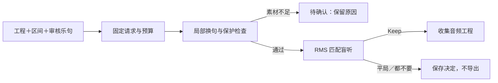

# 锁定换句自动工作流：技术交付

2026-09-27。任务 WORKFLOW-P0-20260927，用户直接授权按新版闭环修改并使用 Claude Code。首条流程已接通：**指定人声区间换不同回答句 → 保护检查 → 有限候选 → RMS 匹配盲听 → 用户 Keep → 收集 Ableton 音频工程**。本报告不表示完整 PRD P0、音乐质量或 Live 实机验收完成。

## 如何使用

用户给出一份 BeatLab score 工程、目标声部/区间、当前唱句身份、经用途与内容审核的候选句。代理可据此准备结构化请求；运行时用本地脚本完成，不需要每次调用模型写代码。输入暂不直接支持任意 `.als` 或任意自然语言反馈自动解析。

1. `creative_workflow submit` 固定请求及输入哈希。
2. `run` 最多尝试 6 次、保留最多 2 个不同家族候选；独立坏来源不阻断其他可用来源。
3. `review` 打开匿名 A/B/C 页面，在同一播放位置切换，记录时间点意见。
4. 用户明确 Keep 后自动导出；平局/都不要只存决定。页面显示工程目录，刷新保留。

完整 JSON、精确 CLI 和恢复说明见 [使用指南](../product/locked-workflow.md)。新流程也已接入 `pipeline/pipeline.py creative_workflow`。工作目录为 `/Volumes/SanDisk2TB/BeatLab/.cache/album-execution-20260919`，使用 `/Volumes/SanDisk2TB/BeatLab/.venv/bin/python`；主根仍在旧分支，不能从旧代码运行新功能。

## 已验证

| 检查 | 实际结果 |
|---|---|
| 回归 | 原基线 272；最终 400 项测试，34.833 秒，全部通过，无跳过 |
| 锁定保护 | 合成人声只换 5–10 秒；5 条非目标 stem/MIDI 字节一致，目标轨区间外采样最大差 0，父文件 SHA/mtime 保持 |
| 真正不同的测试内容 | 原句“借一点光”；两个由自写文本本地语音合成的回答句“把夜色唱亮”“天亮就出发”。身份由显式审核元数据提供，非 ASR 判断 |
| 音量匹配 | 20.4 秒三版本同区间 RMS；编码后差约 0.000000003 dB，衰减而非抬升；非 LUFS 或审美评分 |
| 真实 CLI | 提交、两次实际尝试、两候选、重复提交/运行复用；取消任务 0 次生成 |
| 真实浏览器 | 同秒快速切换保留播放意图；测试笔记/拒绝决定持久化；独立测试 Keep 自动导出，刷新显示工程目录 |
| 导出与恢复 | ALS、参考混音、分轨、MIDI、score、manifest、配方与替换原句收集；重复 finish 全部文件 SHA/mtime 不变；导出已落盘而状态未写入的恢复测试通过 |
| 负面场景 | 输入/请求/候选配方/盲听音频变化阻断；暂时导出失败可沿原决定恢复；取消时不发布交付；中断 staging 不另花预算 |
| 原音乐 | 此次清单范围为媒体根 `beats/**/full_mix.wav` 的 15 份文件，SHA/mtime 全部保持。不同于此前更宽的 16/24 文件统计 |

机器证据：[locked-workflow-2026-09-27.json](../../evidence/locked-workflow-2026-09-27.json)。日志与隔离媒体保留在执行目录 `.cache/locked-workflow-20260927/`，未提交音频或数据库。

## 演示入口

[本机演示盲听](http://127.0.0.1:8798/)：包含原版和两个候选，尚未代填用户决定。依赖本机服务持续运行；可按指南重新启动。

任务目录：`/Volumes/SanDisk2TB/BeatLab/.cache/album-execution-20260919/.cache/locked-workflow-20260927/demo-speech/jobs/locked-reply-demo-20260927`。

这是合成人声和原创合成器的技术演示，不是新的专辑曲或真实歌手采样。浏览器自动导出的 Keep 测试另存于 `technical-keep-only-20260927`，笔记明确写明“测试 Keep 自动导出，不代表用户音乐偏好”。该测试的 delivery 不作为用户保留作品。

## Claude Code 实际分工

两波、共 4 个固定请求，最大并发 2；全部通过 `scripts/claude_plan.py` 使用 Coding Plan 的 `doubao-seed-evolving`。第一波换句/盲听，第二波任务管理/文档。已核对原输入与输出哈希，独立执行测试后采用，主代理负责接口、真实音频/浏览器、一次本地质量修正和最终交付。

worker 的原 41 项测试独立通过；补充 11 个恢复/输入/导出反例先失败，修正后 52 项通过。盲听包报告因同时包含预期红测而被 runner 标 blocked，原进程与产物经独立核验采用，没有为了状态重发。第二波 worker 读取的盲听文件与当前版只有主代理增加导出结果展示的兼容改动，已专门复核接口。没有按量兜底；客户端费用估算不当作套餐账单。旧 F03 和过期算法 unknown 未重发。

## 仍需完成

- 当前依赖审核过的乐句身份/用途；自动乐句地图、唱词识别、角色检索与混合录音分离尚未串联。
- 当前修改一条声部的明确区间，不能把同句重切或移调认作新内容；素材不足时需要补充真正不同的句子。
- 导出为全长音频分轨 Clip，可在 DAW 手动编辑；源 MIDI、配方与替换原句保留。尚未交付原生逐切片 Clip 或 MIDI 发声乐器重建。
- Ableton UI 访问超时，实际打开、保存、重开、迁移打开与 Live 回渲染未验。
- 音乐是否值得保留、是否愿意继续制作由用户决定；没有自动 Keep 或“好听分”。

下一步是用户试听此流程，或指定一份正式工程与替换区间，使用核验素材做一次真实修订。完整 PRD 与 [实施计划](../superpowers/plans/2026-09-27-locked-workflow.md) 已同步；商业、发布、全量爬虫和整张专辑生成未启动。
