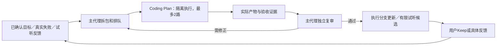

# BeatLab 持续执行与定期复审提案

2026-09-27，用户希望思考：哪些任务能由Coding Plan长期推进，怎样定时更新项目并由主代理定期review。本轮交付可审阅方案，不把“无限token”的假设当成真实无限额度或全部产品方向的实施授权。原每日22点夜班保持；7天试运行尚未启用。

## 推荐方式

用户一次确认一组产品范围与边界，主代理维护少量可验收任务；Plan做主要代码/实验工作，主代理复审后采用，用户决定音乐是否值得留。每个子任务有限、可结束，长期持续来自新问题和新证据。

失败、unknown、范围冲突和积压各有停止条件，图中的循环不表示无限重试。技术accepted和音乐Keep是两种状态。

## 工作池与首批顺序

详见[任务池](../../product/continuous-task-pool.md)。长期价值最高的是乐句/节拍/拉伸基准、内容身份、真实锁定修订、工程还原、按缺口补素材及有假设的编排实验。测试数量、调用量、库存和轨数不作为成果指标。

先补队列/并发/过期恢复闸门；再建立可复现基准，拿正式翻采工程的隔离副本验证真实修订，最后围绕一个已确认音乐目标做两种候选。自动内容识别需要人工真值；Live界面阻塞未恢复时不重复尝试。任务池列出的方向仍待选择。

## 7天试运行建议

北京时间22/00/02点为执行机会、09点集中复审；同一现有心跳按时段分工，最多2路、未审与在途合计最多4包、音乐候选最多积压2组、零新增付费。每包20分钟、每次唤醒最多一波/45分钟，错过不补跑。每天提供一份有实质变化的简报和最多2个试听候选，不强求每天一首成品。

具体契约、停止和恢复见[运行协议](../../product/continuous-operations.md)。待实现的队列与共享并发闸门先离线验证，再启用调度。只改定时提示词不能宣称这个机制已经实现；不另建常驻服务或转云端。

## 本轮实际工作

同一波两个独立cc-plan文档包：beatlab-continuous-pool-20260927-a1、beatlab-continuous-operations-20260927-a1，doubao-seed-evolving。两个runner均正常结束、返回verifying；核对产物SHA与文件白名单后，经主代理校正采用。本轮没有产品代码、模型评测、音频生成或新调度执行，文档任务未运行测试。

复审修正：相邻窗口/另一演奏不直接决定内容家族；用户未听不计失败；工程技术验收不等于Keep；主入口额度耗尽后的调度不能保证；7天为试运行窗口，不是自动丢弃未听作品的期限；Live阻塞不作为每天重复任务。保存下游原稿与原状态，不让其自报成功替代核验。

证据：[规划委派与审查](../../../evidence/continuous-lab-proposal-2026-09-27.json)。与主线、MVP总计划和Hub共同恢复，方案文件本身不会触发任务。
